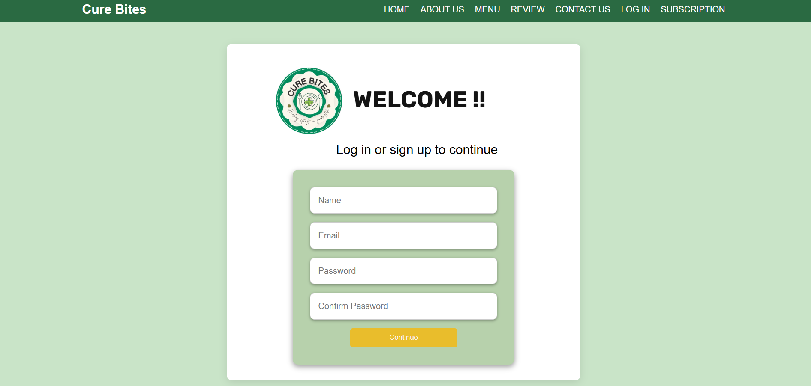
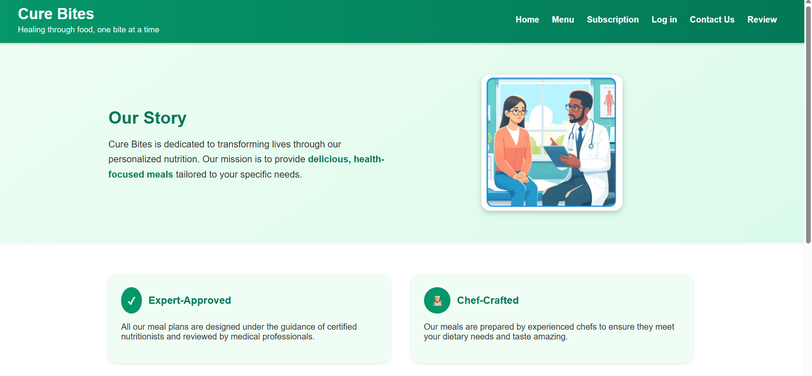
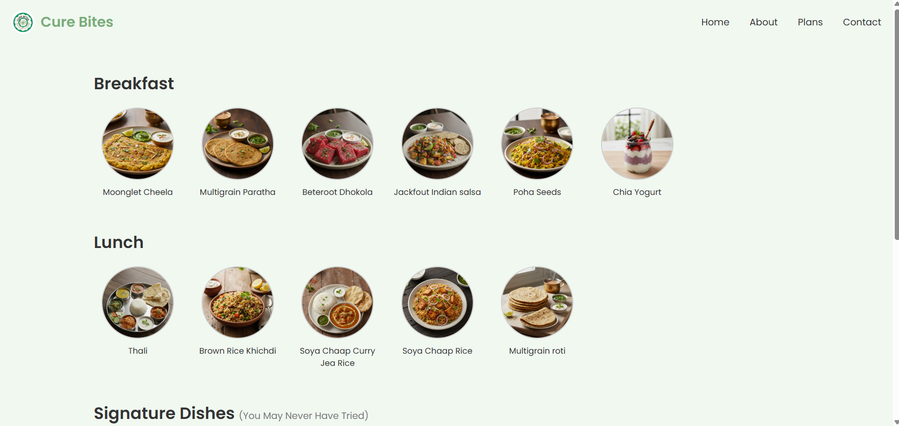

# Cure Bites – Personalized Meal Web Application

## Project Overview
**Cure Bites** is a healthcare-focused web application designed to provide personalized meal recommendations based on uploaded health reports and dietary preferences.

## Objective
- **Help users choose healthy meals** according to their health reports  
- **Apply web development and database concepts** in a real-world healthcare use case  
- **Build a user-friendly system** connecting medical reports with nutrition planning  

## Features
- **Upload health reports** for personalized meal analysis  
- **Meal recommendations** by nutritionist based on health report and dietary preferences  
- **Secure storage** of user reports and data using a database  
- **Responsive design** for better accessibility  
- **Simple and clean UI** focused on healthcare usability  

## Technologies Used
- **Frontend:** HTML, CSS, JavaScript  
- **Backend:** Node.js, Express.js  
- **Database:** MongoDB   

## How It Works
1. **User uploads** their health report  
2. **Nutritionist** makes plan
3. **Chef** prepares meal   
4. **User data is stored securely** in the database

## Screenshots
### Home Page

### Sign-in Page

### About Us Page

### Menu Page

### Subscription Plan

### Contact Us Page

